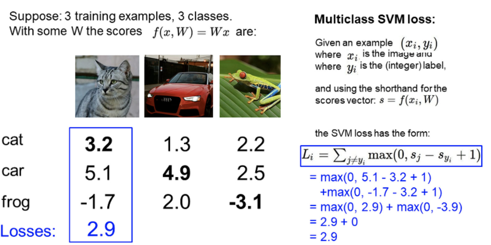
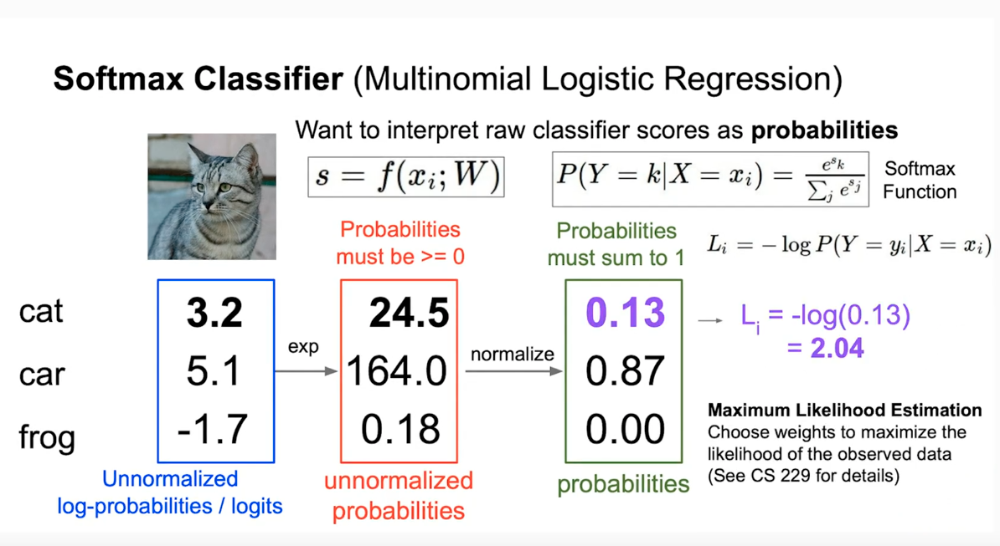

# Loss Function

### what is loss function?
The indicator that shows how **incorrect** models such as regression or classification are.

### Hinge loss
sysnonym: Support Vector Machine (SVM loss)

<!-- $$
L_i=\sum_{j \neq y_i}max(0, s_j-s_{y_i}+1)
$$ --> 
</br>
</br>
<div align="center"></div>
</br>

<!-- $$
SVM = \frac{1}{N}\sum_{i=1}^{N}L_i
$$ --> 

<div align="center"></div>
</br>




max(0, 5.1 - 3.2 + 1) + max(0, -1.7 - 3.2 + 1)

= max(0, 2.9) + max(0, -3.9)

= 2.9

also calcurate same way for car and forg...

||cat|car|frog|
|-|-|-|-|
|loss|2.9|0|12.9|

and final value is mean of losses: **5.27**

### Cross Entropy


```logits > exp(logits) > softmax(exp(logits)) > -log(softmax(exp(logits)))```

Expression Cross Entropy calculation with Python code.

```python
import numpy as np

logits = [3.2, 5.1, -1.7]
s = np.sum(np.exp(logits))
# 188.7371210210638

softmax = np.exp(logits) / s
# array([0.12998254, 0.86904954, 0.00096793])
# sum of softmax's elements is 1.

label = [1, 0, 0] # cat is 1, other are 0. (answer is cat)

crossentropy = np.sum([-l * np.log(s) for l, s in zip(label, softmax)])
# 2.04035515280017

crossentropy = -np.log(softmax[0])
# 2.04035515280017
``` 

### Mean Squared Error
in korean: 평균 제곱 오차


* N is the number of data points
* Yi represents observed values
* Y^i represents predicted values